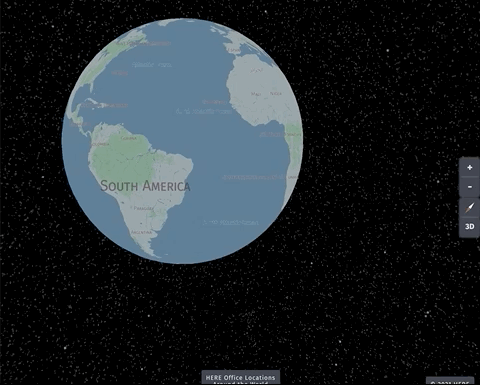

# Getting Started with harp.gl and React



## Step 1: add your API Key

In the root folder (where the README.md is located), create a file called `.env`
```
cd 3d-globe
touch .env
```

In your `.env` file, create a variable called `REACT_APP_API_KEY`, and set the value to your own API Key:
```
REACT_APP_API_KEY="YOUR_API_KEY"
```

### Step 2:
Install the dependencies:
```
npm install
```

### Step 3:
Run the application locally:
```
npm start
```
